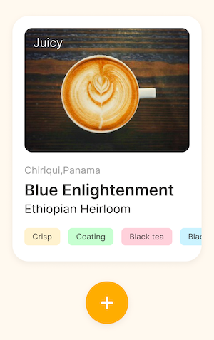

# Тестовое задание по фронтенду
Само задание в файлике input.pdf

## Установка

1. Клонирование репозитория
2. Запуск:
   ```bash
   npm install
   npm run dev

## Примечания

- Для плэйсходлера использовал не самую легкую, но забавную картинку. Понимаю, что можно сделать легче или вообще нарисовать стили на CSS, а анимацию на SVG.
- Картинки лучше загружать в формате WebP и обеспечить поддержку прогрессивной загрузки со стороны веб-сервера.
- Цвета тегов генерируются случайным образом, когда исчерпывается базовый набор (довольно скромный).
- С троттлингом процессора на фронтенде никогда не боролся, но попробовал прикрутить свой опыт учета времени из работы с железом. Потенциально подверженная влиянию троттлинга фича - отсчет времени. Беру разницу в системном времени вместо `setInterval`. Более точного времени в JS не завезли, насколько мне известно.
- Просили `mobile first`, но я прикрутил поддержку колесика мышки для списка тегов, так как мышка была под рукой.
- **По UI**: просится фильтр по тегам, но мне не попались одинаковые теги, поэтому не стал делать.
- **По UI**: возможно, стоило бы добавить кнопки перемотки к нужному моменту ленты и как-то отмечать состояние "просмотрено".
- В качестве воздействия пользователя на приложение взял кнопки, движения мышки и события тача.

## Верстал по такому шаблону
